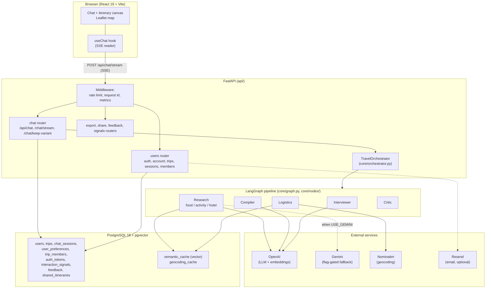
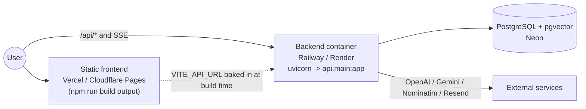

# Architecture

Atlas has three deployable pieces: a React frontend, a FastAPI backend that runs a LangGraph agent
pipeline, and a PostgreSQL database with the pgvector extension. The backend streams chat over
Server-Sent Events, so it runs as a long-lived process rather than a serverless function.

## System overview

The dotted edges are conditional: Gemini is used only when the `USE_GEMINI` flag in
[`core/llm.py`](../core/llm.py) is `True` (it is `False` by default, so all roles run on OpenAI and
research runs without Google Search grounding). Email send is a no-op unless a provider is
configured.

## Request flow

A planning turn from the web UI:

1. The browser sends `POST /api/chat/stream` with the message and, if known, the `session_id` and an
   auth token. Anonymous users may attach intake preferences as `client_prefs`.
2. Backend middleware applies the per-IP rate limit and attaches `X-Request-ID` /
   `X-Response-Time-Ms` headers.
3. The chat router checks edit access, loads or creates the session, resolves seeded preferences and
   the learned-signal context, and opens an SSE response.
4. `TravelOrchestrator.stream_chat` runs the LangGraph pipeline and yields events; the router writes
   each event to the stream and folds it into per-variant buckets.
5. When the stream ends, the router persists the turn (history, merged slots, the trip and its map
   geo) in its own database session, or stages both variants if compare mode produced two.

## Where logic lives

Core planning logic is kept I/O-free and testable. Pure decision helpers (the interview gate in
[`core/nodes/interviewer.py`](../core/nodes/interviewer.py), signal scoring in
[`core/signals.py`](../core/signals.py), access rules in [`api/authz.py`](../api/authz.py), token
lifecycle in [`core/tokens.py`](../core/tokens.py)) are unit-tested without a database; the database,
clock, network, and LLM calls live at the boundary.

## Deployment topology

The three pieces deploy independently. The backend must run as a persistent process because the SSE
endpoint holds an open response for the length of a planning run.

Notes that matter for deployment:

- **Do not run the SSE backend on serverless/edge**: those platforms buffer responses and enforce
  short execution limits, which breaks streaming.
- **Schema**: Alembic is the source of truth. The app runs `alembic upgrade head` on startup
  (idempotent); for multiple replicas, run the migration once as an explicit release step instead.
- **Per-instance state**: the rate limiter and metrics counters in
  [`api/main.py`](../api/main.py) are in-process dicts, so they do not aggregate across replicas yet.

The full runbook (recommended hosts, the complete environment-variable checklist, backups, and the
migration release step) is in [DEPLOYMENT.md](../DEPLOYMENT.md).
