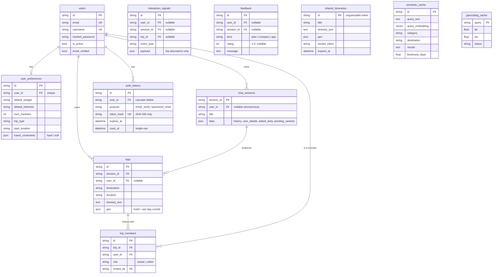

# Data model

All durable state lives in PostgreSQL. The SQLAlchemy models are in
[`core/database.py`](../core/database.py); Alembic migrations in
[`migrations/versions/`](../migrations/versions/) are the source of truth for the schema, and the
baseline migration enables the `pgvector` extension before creating the tables.

## Entity relationships

## Table notes

- **users**: account root. `email_verified` gates the verification flow; `is_active` allows soft
  deactivation. Deleting a user cascades its `auth_tokens` via the ORM relationship, and the account
  delete endpoint also removes the user's trips, sessions, and preferences in one transaction.
- **user_preferences**: one row per user (saved travel defaults). The traveler profile reuses these
  columns rather than adding new ones: budget, interests, party size, trip type, and home/start
  location map onto existing fields, and `travel_constraints` is a structured `{hard, soft}` JSON
  blob (the legacy free-text `constraints` column is superseded by it).
- **chat_sessions**: `user_id` is nullable so anonymous conversations are still stored. The `data`
  JSON column holds the conversation `history`, the merged `user_details`, the `asked_slots` set, and
  (transiently) `pending_variants` while an A/B compare awaits a choice.
- **trips**: a saved itinerary. `geo` is the `{hotel, days[]}` map payload (null for text-only or
  legacy trips). A trip belongs to a session and, optionally, an owning user.
- **trip_members**: collaborators on a trip. The owner stays on `trips.user_id` and is not a member
  row; this table holds invited registered users with a `viewer` or `editor` role (a unique
  constraint on `(trip_id, user_id)` and a check constraint on `role`). Access to the chat session
  behind a trip is derived from membership of that trip.
- **auth_tokens**: single-use, expiring tokens for email verification and password reset. Only the
  SHA-256 hash of the token is stored; the raw value exists only in the email link. A background
  sweep prunes used/expired rows.
- **interaction_signals**: implicit behavioral signals (a plan kept, regenerated, or edited; a
  variant kept; a trip opened). `user_id` is nullable so anonymous sessions are captured. The
  `payload` holds only trip descriptors, never itinerary text or PII, and a composite
  `(user_id, created_at)` index serves the "recent signals, newest first" lookup.
- **feedback**: one table for all feedback contexts (`plan`, `compare`, `app`). A row must carry a
  rating, a message, or both (enforced by a check constraint).
- **shared_itineraries**: a public, immutable snapshot of a delivered plan under an unguessable id.
  It deliberately carries no `user_id` or session, so a public link cannot reveal who created it or
  their saved constraints. A `revoke_token` allows deletion and `expires_at` caps its lifetime.
- **semantic_cache**: research results keyed by an embedding (`vector` column) for cosine-similarity
  reuse, with per-category freshness. An IVFFlat index is created once the table has enough rows.
- **geocoding_cache**: Nominatim lookups cached by query string, so repeated geocoding is free.
