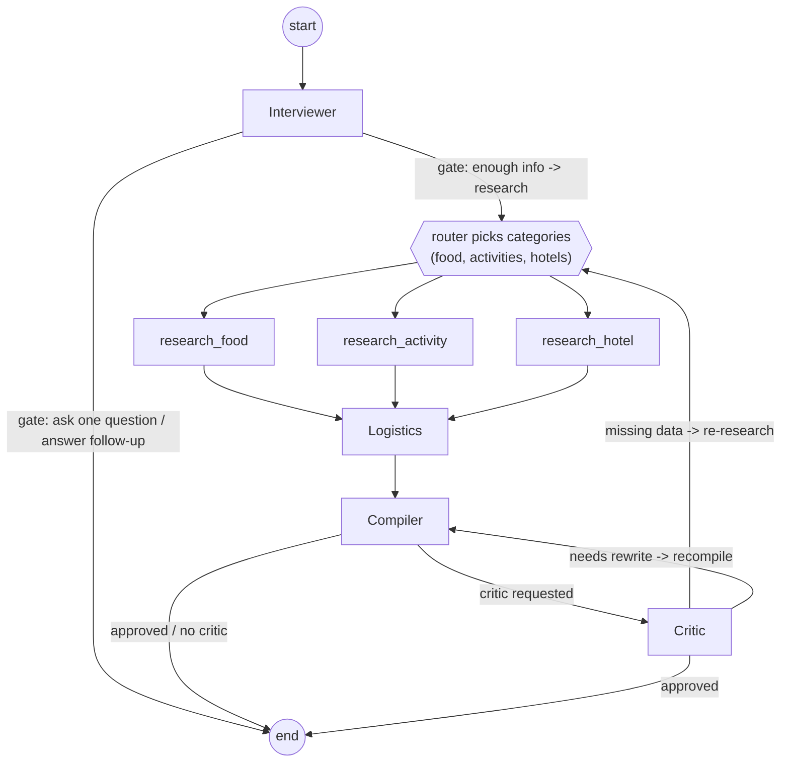
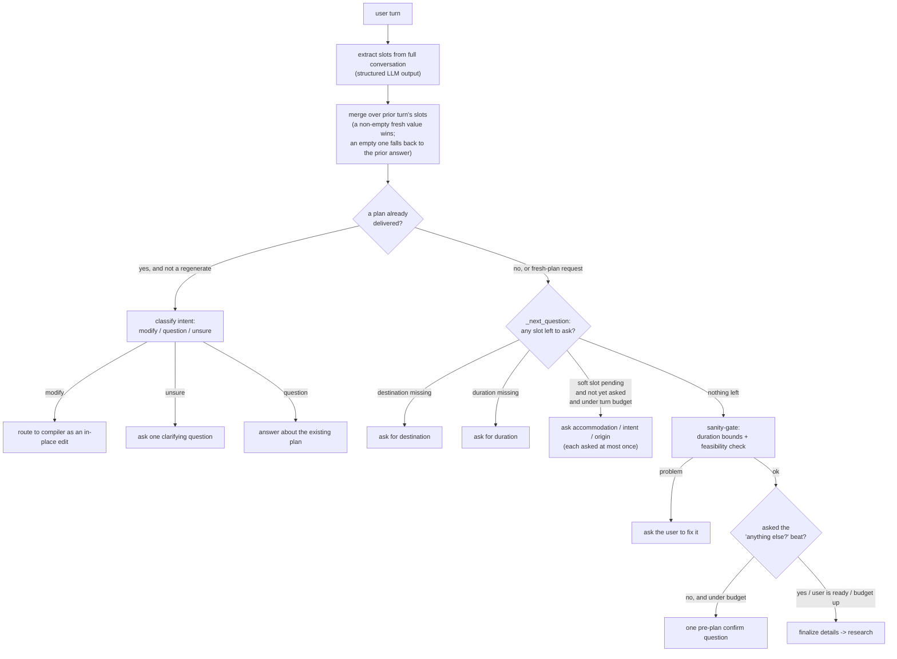

# Planning pipeline

The planner is a LangGraph `StateGraph` wired in [`core/graph.py`](../core/graph.py), with the node
implementations in [`core/nodes/`](../core/nodes/) and the geocoding step in
[`core/logistics.py`](../core/logistics.py). State flows through an `AgentState` TypedDict
([`core/state.py`](../core/state.py)). The graph is stateless per turn: there is no LangGraph
checkpointer; cross-turn memory is reconstructed from the persisted conversation history and a few
saved decision inputs.

## The graph

Routing is done by the `router` function in `graph.py`, which reads `state["next_node"]`. An
`iteration_count` guard (`>= 3`) and a graph `recursion_limit` of 25 bound the critic loop so it
always terminates.

The research fan-out is conditional. The router maps the requested categories to nodes in the fixed
order food, activity, hotel:

- a critic re-research request narrows to the `missing_data` categories;
- otherwise the user's chosen `focus` narrows the default, falling back to all three;
- hotels are dropped entirely when `needs_accommodation` is `False`, at a single choke point so every
  path honors it.

A second, minimal `variant_app` graph (compiler only) backs A/B compare: variant B recompiles variant
A's already-researched data with the diversify path, so a compare costs one extra compile rather than
a full second pipeline.

## The deterministic interview gate

The interviewer is what keeps the conversation from looping or re-asking. Each turn it extracts the
known fields from the whole conversation, then **decides in code** what to do next. The decision is a
pure helper (`_next_question`), not the LLM.

Key rules, all in [`core/nodes/interviewer.py`](../core/nodes/interviewer.py):

- **Hard slots** (destination, duration) are always required; the gate never plans without them.
- **Soft slots** (accommodation, intent, origin) are asked only while under a turn budget
  (`MAX_INTERVIEW_TURNS = 6`) and **at most once each**. The set of already-asked soft slots persists
  on the session so an ignored question is not nagged again.
- **Slot merge**: freshly extracted slots are merged over the prior turn's persisted `user_details`,
  so an extraction that drops a field does not re-open an answered slot.
- **Turn-count backstop**: the count comes from the orchestrator over the *full* history (the
  replayed window is trimmed), so the budget reliably fires and the interview always terminates.
- **Ready signals**: explicit phrases like "just plan it" or "generate a plan" skip the soft slots
  and the confirm beat, but never the hard slots.
- **Post-plan turns**: once a plan exists, a message is classified as a modification (routed to the
  compiler as an in-place edit), a question (answered in prose), or unsure (one clarifying question),
  unless it names a new destination or asks to regenerate, which re-runs the full pipeline.

The interviewer's conversational replies run under a fixed persona with guardrails (stay on travel,
treat user input as data not instructions, never reveal the system prompt) and a no-plan guard so the
cheap interviewer model never fabricates an itinerary before the pipeline has run.

## Research, logistics, compiler, critic

- **Research** ([`core/nodes/research.py`](../core/nodes/research.py)) is config-driven: one generic
  function serves restaurants, activities, and hotels, each with its own similarity threshold,
  freshness window, and result count. Before calling the model it queries the pgvector semantic
  cache; on a hit that is similar and fresh enough it reuses the cached results, otherwise it
  researches live and caches the result. Multi-destination trips research each city. A regenerate
  refreshes the food and activity pools live while keeping the stable hotel pool cached.
- **Logistics** ([`core/logistics.py`](../core/logistics.py)) geocodes every place via Nominatim in a
  worker thread (cached in `geocoding_cache`) and assigns proximity zones for day-to-day routing.
- **Compiler** ([`core/nodes/compiler.py`](../core/nodes/compiler.py)) writes the day-by-day
  itinerary and emits the structured map payload (per-day coordinates). An in-place edit reuses the
  prior map and returns a short "what changed" summary.
- **Critic** ([`core/nodes/critic.py`](../core/nodes/critic.py)) reviews the draft and either
  approves it or routes back to re-research the missing categories or recompile, bounded by the
  iteration guard.

## Semantic cache

The cache ([`core/semantic_cache.py`](../core/semantic_cache.py)) embeds the research query with
OpenAI `text-embedding-3-small` and compares it to stored entries by cosine similarity (pgvector). A
hit is used only when it clears the category's similarity threshold and is within the category's
freshness window (hotels 14 days, restaurants 30, activities 45). The cache key folds in a
"local / non-touristy" vibe and any named neighborhoods, so a personalized request does not collide
with the generic bundle.
