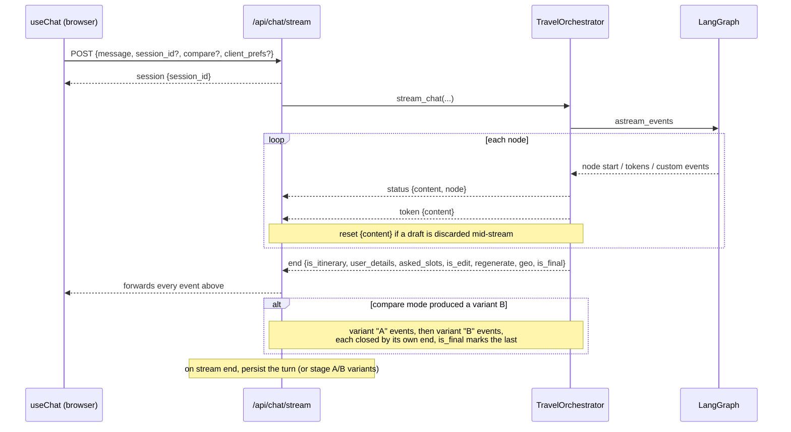

# Streaming contract

Chat is delivered over Server-Sent Events. The endpoint is `POST /api/chat/stream`
([`api/chat.py`](../api/chat.py)); the orchestrator that produces the events is
[`core/orchestrator.py`](../core/orchestrator.py); the browser reader is
[`frontend/src/hooks/useChat.js`](../frontend/src/hooks/useChat.js).

Each SSE line is `data: <json>\n\n`, where `<json>` is one event object with a `type` field.

## Event sequence

## Event types

| `type` | Emitted by | Payload | Meaning |
|---|---|---|---|
| `session` | the endpoint, first | `session_id` | The session id; the client stores it and resends it next turn. This is what gives the web UI cross-turn memory. |
| `status` | orchestrator, on node boundaries | `content`, `node` | A human-readable stage label (for example "Compiling your itinerary..."). Drives the progress pills and the themed loader. |
| `token` | orchestrator, model stream | `content` | A chunk of the streamed reply or itinerary text. The `PLANNING_STARTED` trigger marker is stripped from the stream. |
| `reset` | orchestrator, custom event | `content` | Discard the partial draft accumulated so far and start the visible message over (used when the pipeline replaces an in-progress draft). |
| `end` | orchestrator, once per variant | see below | The turn (or one variant) is complete. |
| `error` | the endpoint | `content` | An internal error occurred; the generic message is safe to show. |

The `end` event carries the metadata the client and the persistence layer need:

- `is_itinerary`: whether a plan was produced this turn (vs. an interview reply).
- `user_details`: the merged slots, persisted so the next turn does not re-ask.
- `asked_slots`: which soft slots have been put to the user (persisted, ask-once).
- `is_edit`: an in-place edit of the existing plan (the client keeps the current map).
- `regenerate`: a from-scratch re-plan.
- `geo`: the `{hotel, days[]}` map payload for a fresh plan (absent for an edit).
- `is_final`: `true` when no further variant follows.

## Compare mode

When the request sets `compare: true` and the turn produces a fresh plan, the stream sends two
diversified variants. Every event is tagged with a `variant` field (`"A"` or `"B"`), and each variant
is closed by its own `end` event; `is_final` marks the last one. Single-itinerary turns send no
`variant` tag at all, so older clients are unaffected.

During a compare stream the backend persists **nothing**: both variants are staged on the session,
and `POST /api/chat/keep-variant` commits the one the user chooses. The client engages its compare
view only once a variant actually reaches the compiler stage (an interview question never does, so it
stays an ordinary reply).

## Persistence and cancellation

The endpoint folds every streamed event into per-variant buckets as it forwards them, then in a
`finally` block:

- if the client cancelled mid-stream, it discards the partial so no half-built reply lands in
  history;
- if two variants were produced, it stages them for a later keep-variant call;
- otherwise it persists the single turn (history, merged slots, the trip and its map geo) in its own
  database session, because the request's session is already closed by the time the stream finishes.
